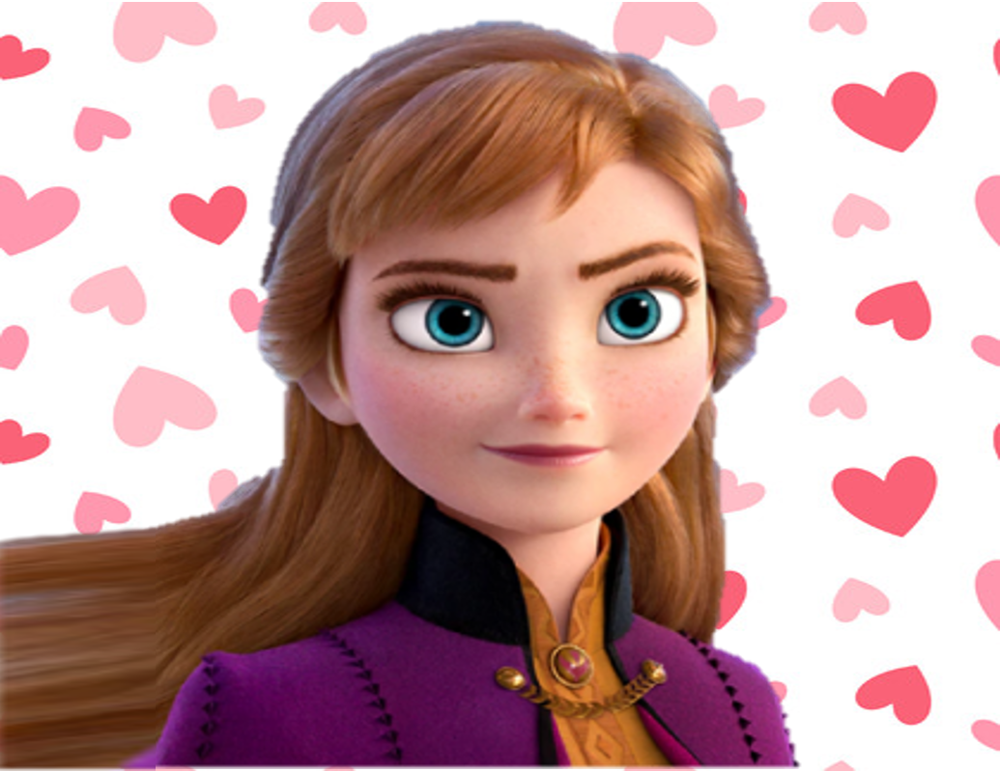
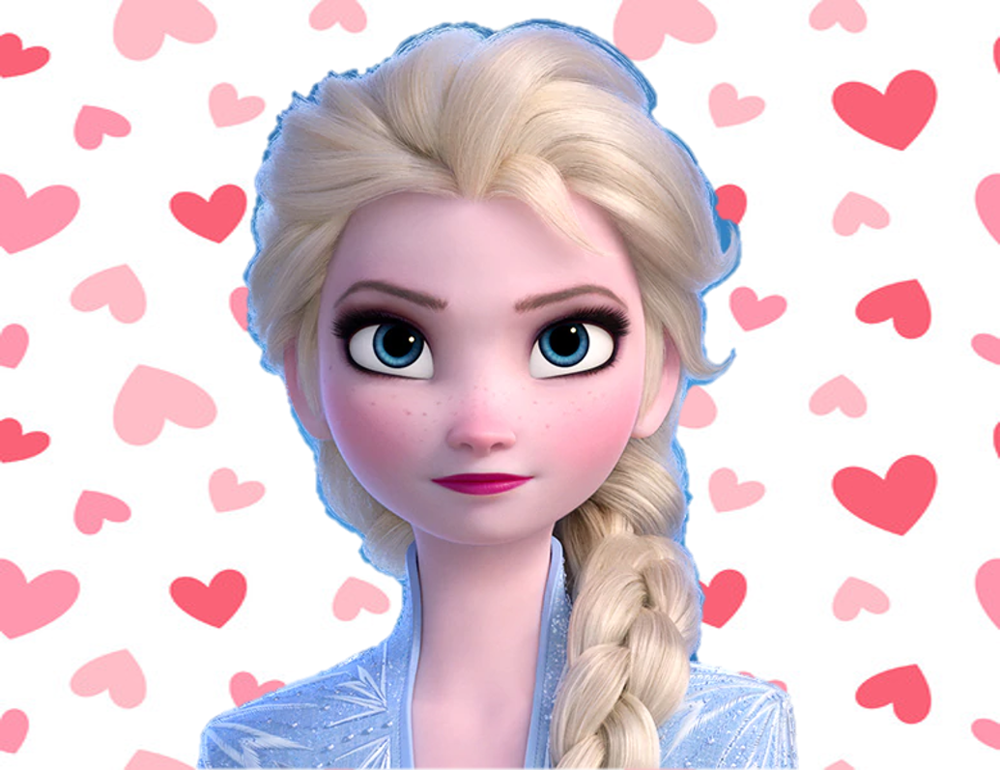
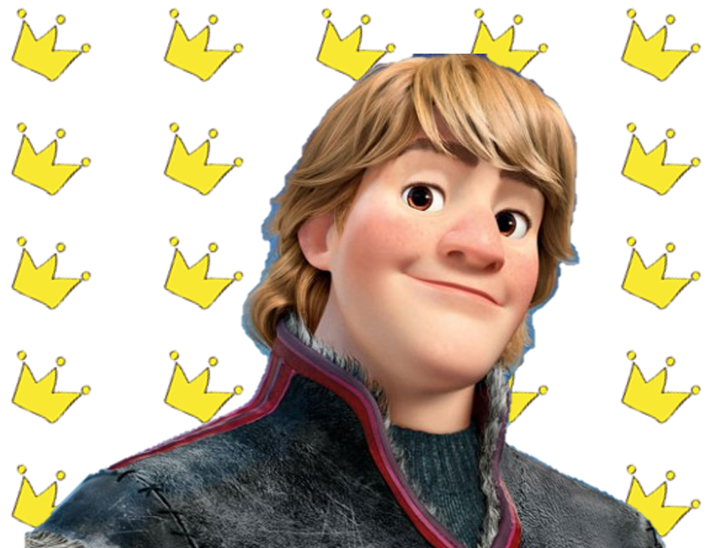
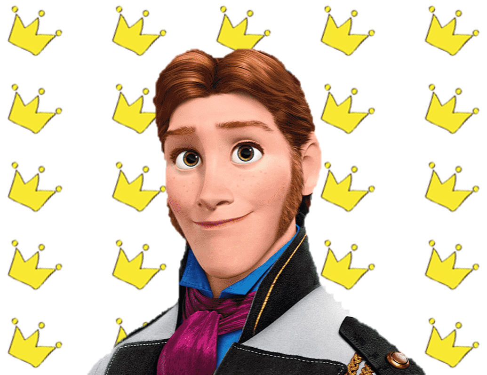

## pth
[link](https://iiitaphyd-my.sharepoint.com/personal/radrabha_m_research_iiit_ac_in/_layouts/15/onedrive.aspx?id=%2Fpersonal%2Fradrabha%5Fm%5Fresearch%5Fiiit%5Fac%5Fin%2FDocuments%2FWav2Lip%5FModels%2Fwav2lip%5Fgan%2Epth&parent=%2Fpersonal%2Fradrabha%5Fm%5Fresearch%5Fiiit%5Fac%5Fin%2FDocuments%2FWav2Lip%5FModels&ga=1)
다운로드 후 `checkpoints/` dir에 위치시킨다

## Requirements
```code
pip install requirements.txt
```
* If needed(maybe window os)
```code
conda install ffmpeg
```

## Example
```code
python generate_lipsync.py --input_image ./my_data/elsa.png --input_text "안나야 가자 아렌델로" --gender 0
```
* --input_image: 얼굴 이미지
* --input_text: 생성할 텍스트
* --gender: 0 여성, 1 남성

## Result
* 최종 결과 파일은 `FINAL` dir 안에 저장됨

## 예문 리스트(230411)
* File: [FINAL.zip](./FINAL/FINAL.zip)
    * 캐릭터: 엘사, 안나, 크리스토프, 한스







### 음식 관련
1. 내가 제일 좋아하는 과일은 수박이에요  
2. 나는 엄마랑 밥을 먹을 때 가장 행복해요  
3. 나는 초콜릿과 사탕을 매우 좋아해요  
4. 나는 피자와 핫도그를 좋아해요  
5. 오늘 점심에는 치킨 너겟과 감자 튀김을 먹을 거예요  

### 운동 관련
1. 나는 놀이공원에서 롤러코스터를 탈 거예요  
2. 나는 자전거를 타고 주변을 돌아다니면서 신나게 운동해요  
3. 오늘 유치원에서 달리기를 했어요  
4. 친구들과 축구를 하면 기분이 좋아져요  
5. 나는 달리기를 잘해요  

### 가족 관련
1. 내가 가장 사랑하는 건 가족이에요  
2. 엄마는 나를 사랑하세요  
3. 아빠는 정말 멋있어요  
4. 우리 가족은 다섯 명이에요  
5. 저녁은 매일 가족들과 먹어요  

### 학교 관련
1. 나는 학교에 가는 게 재미있어요  
2. 학교에 가면 친구들과 선생님이 있어요  
3. 우리 학교에는 도서관이 있어요  
4. 내일은 학교에 가는 날이에요  
5. 친구들과 먹는 급식은 맛있어요  


---
## ISSUE
* pre-trained model은 사람 얼굴을 대상으로 학습된 모델이라 애니메이션 얼굴에 적용했을 때 어색함이 있음
* 해결 방안: 애니메이션에 대한 데이터를 추가하여 transfer-learning
    * 애니메이션 데이터 구축 방안
        1. 영상(SLR2) 불러와서 소리/영상 분리하고 프레임 추출
        2. 프레임 각각 인공지능 돌려서 style transfer
        3. 프레임 이어붙여서 영상으로 제작
        4. 소리와 합성하여 저장
    * 문제점
        * U-GOT-IT: pre-trained model이 없어 바닥부터 학습해야 하고, 다른 사람들이 만들어놓은 가중치로 실험했을 때 성능이 좋지 않았음
        * CartoonGAN: pre-trained model이 있긴 하나 결과 확인해보았을 때 애니메이션보다는 수채화 느낌 + 기대한 만큼의 성능 안나옴
        * AnimeGANv2: 성능은 가장 좋으나 결과를 보면 뭉게지는 경향이 있음
        * 공통적으로 style transfer 모델이 모두 입모양을 제대로 볼 수 있을 만큼 정교하지 않음
        * SLR2 데이터 확보 문제: 지도 교수의 승인 필요